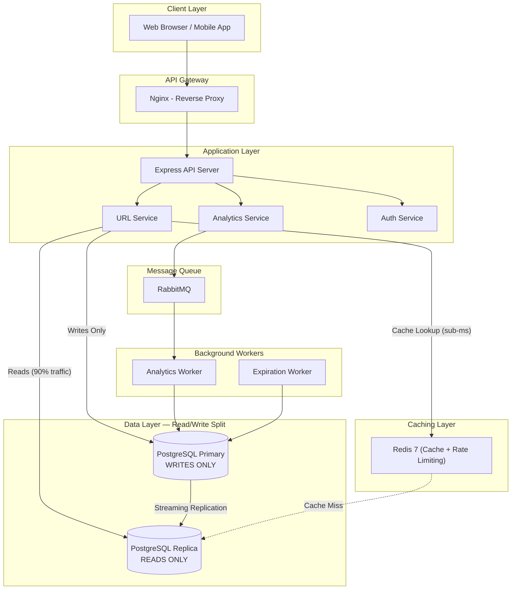
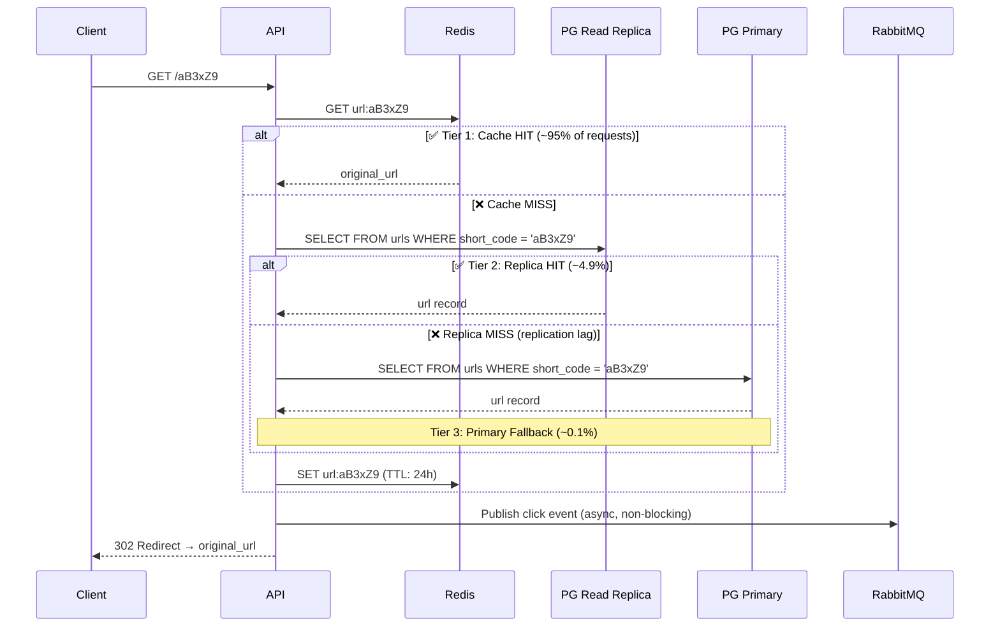
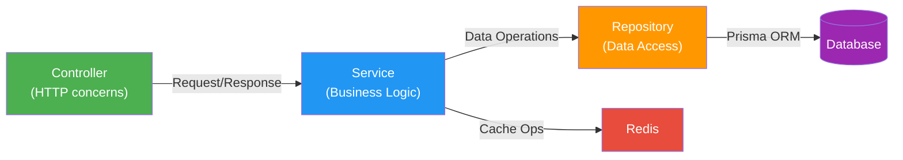
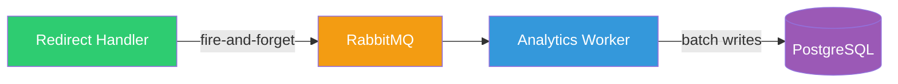
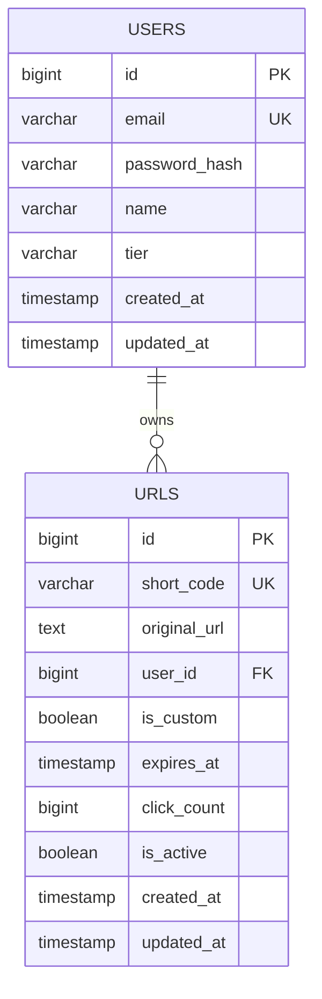
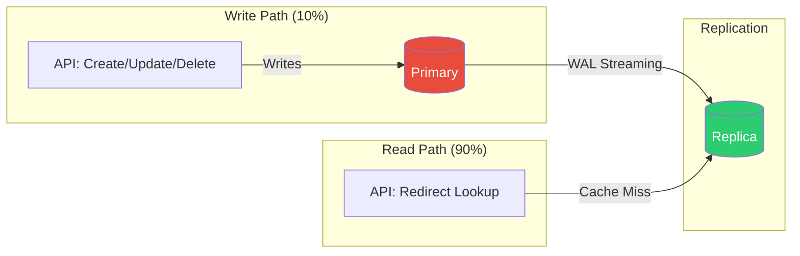
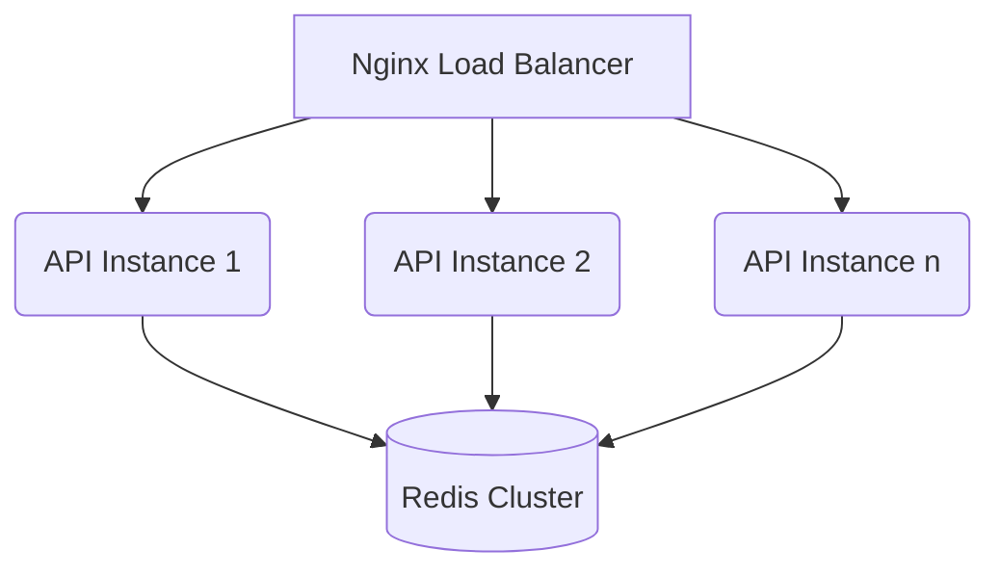

# 🔗 Shrinkr — High-Performance URL Shortener

[](https://nodejs.org)
[](https://www.typescriptlang.org)
[](https://nextjs.org)
[](https://www.prisma.io)
[](https://opensource.org/licenses/MIT)

A **production-grade URL shortener** built to handle massive scale. Features a stateless **Modular Monolith** architecture with **Read/Write DB splitting**, designed for high read throughput (90%+ reads), sub-10ms redirects, and real-time asynchronous analytics.

> Built with Node.js, Express, TypeScript, PostgreSQL, Redis, RabbitMQ, and Next.js. Engineered for zero-downtime horizontal scaling.

---

## 📐 Architecture Overview

### System Architecture



### Read/Write Split — Why It Matters

URL shorteners have a **~100:1 read-to-write ratio**. For every URL created, it gets clicked hundreds of times. This architecture separates the hot read path from writes:

| Path | Traffic | Database | Latency |
|------|---------|----------|---------|
| **Writes** (create/update/delete) | ~10% | PostgreSQL Primary | ~10ms |
| **Reads** (redirect lookups) | ~90% | Redis → Replica → Primary fallback | <10ms |

---

### Three-Tier Redirect Flow

The redirect endpoint is the **most latency-sensitive** path. Every millisecond counts.



> **Why 3 tiers?** Redis absorbs ~95% of reads (sub-ms). The replica handles ~4.9% (cache misses). The primary is only touched for writes and the rare replication-lag edge case (<0.1% of reads).

---

### Layered Architecture (Controller → Service → Repository)

Each module follows a strict layered pattern with clean separation of concerns:



| Layer | Responsibility | Knows About |
|-------|---------------|-------------|
| **Controller** | Parse request, send response, HTTP status codes | Service only |
| **Service** | Business logic, validation, orchestration | Repository + Cache |
| **Repository** | Database queries, data mapping | Prisma ORM |

> Each layer depends only on the layer below it — **Dependency Inversion Principle**.

---

### Async Analytics Pipeline

Click events are **never** written synchronously during redirects. They flow through RabbitMQ for decoupled processing:



---

### Short Code Generation Strategy

Uses **Base62 encoding of auto-increment IDs** with XOR obfuscation:

```
Database ID → XOR with secret key → Base62 encode → Short code
     42     →     99385214410      →   CkWPWCeY   → http://localhost:3000/CkWPWCeY
```

| Property | Value |
|----------|-------|
| **Algorithm** | Base62(XOR(auto-increment ID)) |
| **Character set** | `a-z`, `A-Z`, `0-9` (62 chars) |
| **Min length** | 6 characters |
| **Collision risk** | **Zero** — each DB ID is unique |
| **Guessability** | Non-sequential due to XOR obfuscation |

---

### Database Schema



### PostgreSQL Replication Topology



---

## � Scalability & The Modular Monolith

This system is built as a **Modular Monolith**. It runs as a single Node.js instance, but internally acts like strict microservices. This provides the deployment simplicity of a monolith with the strict boundaries of microservices.

### Handling Massive Traffic (Horizontal Scaling)
Because the API server is **100% Stateless** (sessions in JWTs, caches in Redis), you can infinitely scale out by running multiple copies of the API server behind a Load Balancer (Nginx/AWS ALB). The async nature of Node.js ensures a single instance handles thousands of concurrent redirects easily.



### The Path to Microservices (Splitting the API)
URL Shorteners receive extremely imbalanced traffic: the `/:code` Redirect endpoint gets 99% of requests, while `/api/v1/auth` gets <1%.

If your traffic scales so high that pulling 50 identical full-stack API servers becomes too expensive, **our strict directory structure makes it trivial to split**:

1. Clone the repo to Server A. Delete the `auth` and `analytics` modules. Deploy as the **Redirect Service** (scaled to 50x instances).
2. Clone the repo to Server B. Delete the `url` module. Deploy as the **Auth/Dashboard Service** (scaled to 2x instances).
3. The codebase is already architected to support this with zero refactoring.

---

## �🛠 Tech Stack

### Backend

| Layer | Technology | Why |
|-------|-----------|-----|
| **Runtime** | Node.js 20+ | Non-blocking I/O — ideal for I/O-bound redirect workloads |
| **Framework** | Express.js | Mature, minimal, extensible middleware support |
| **Language** | TypeScript | Type safety, self-documenting code, better refactoring |
| **Validation** | Zod | Schema-first validation with TypeScript inference |
| **ORM** | Prisma | Type-safe DB access, migrations, excellent DX |
| **Auth** | JWT + bcrypt | Industry-standard token auth with secure hashing |
| **Logging** | Pino | Fastest Node.js logger, structured JSON output |

### Frontend

| Layer | Technology | Why |
|-------|-----------|-----|
| **Framework** | Next.js 16 | SSR/SSG, App Router, React ecosystem |
| **Styling** | Tailwind CSS | Rapid UI development, consistent design system |
| **Theme** | Dark mode + Glassmorphism | Premium, modern look |

### Infrastructure

| Layer | Technology | Why |
|-------|-----------|-----|
| **Primary DB** | PostgreSQL 16 | ACID, battle-tested, handles all writes |
| **Read Replica** | PostgreSQL 16 (Streaming Replication) | Absorbs 90% read traffic |
| **Cache** | Redis 7 | Sub-ms URL lookups, rate limiting |
| **Message Queue** | RabbitMQ | Async analytics pipeline |
| **Containerization** | Docker + Docker Compose | Consistent dev/prod environments |
| **Reverse Proxy** | Nginx | TLS termination, load balancing |

---

## 🏗 Project Structure

```
url-shortener/
├── apps/
│   ├── api/                          # Backend API (Express + TypeScript)
│   │   ├── src/
│   │   │   ├── config/               # Configuration loader + logger
│   │   │   ├── modules/              # Feature-based modules (SRP)
│   │   │   │   ├── url/              # URL shortening (Controller → Service → Repository)
│   │   │   │   │   └── __tests__/    # Unit tests (hashGenerator, urlValidator, urlService)
│   │   │   │   ├── auth/             # JWT authentication
│   │   │   │   │   └── __tests__/    # Unit tests (authService)
│   │   │   │   └── analytics/        # Click analytics
│   │   │   ├── middleware/            # Auth, rate limiting, validation, error handling
│   │   │   ├── common/               # Errors, utils, constants, types
│   │   │   ├── infrastructure/        # DB clients, Redis, RabbitMQ
│   │   │   ├── workers/              # Analytics + expiration background workers
│   │   │   ├── app.ts                # Express application setup
│   │   │   └── server.ts             # Entry point with graceful shutdown
│   │   ├── tests/                     # Cross-cutting unit tests
│   │   │   ├── authMiddleware.test.ts
│   │   │   ├── errorHandler.test.ts
│   │   │   ├── errors.test.ts
│   │   │   ├── responseHelper.test.ts
│   │   │   └── validateRequest.test.ts
│   │   └── prisma/                    # Schema + migrations
│   │
│   └── web/                           # Frontend (Next.js 16)
│       └── src/
│           ├── app/
│           │   ├── page.tsx           # Landing page + shorten form
│           │   ├── dashboard/         # URL management dashboard
│           │   ├── analytics/[code]/  # Per-link analytics
│           │   └── auth/              # Login + Register
│           └── lib/
│               └── api.ts             # Typed API client
│
├── infra/                             # Infrastructure
│   ├── docker-compose.dev.yml         # PostgreSQL, Redis, RabbitMQ
│   └── nginx/nginx.conf              # Reverse proxy config
│
└── package.json                       # npm workspaces root
```

---

## 🚀 Quick Start

### Prerequisites

- Node.js 20+
- Docker & Docker Compose

### 1. Start Infrastructure

```bash
# Start PostgreSQL (primary + replica), Redis, and RabbitMQ
npm run docker:dev
```

### 2. Install Dependencies

```bash
npm install
```

### 3. Configure Environment

```bash
cp apps/api/.env.example apps/api/.env
# The defaults work with the Docker Compose setup
```

### 4. Run Database Migrations

```bash
cd apps/api && npx prisma migrate dev --name init
```

### 5. Start Servers

```bash
# Terminal 1: Backend API (port 3000)
npm run dev:api

# Terminal 2: Frontend (port 3001)
npm run dev:web
```

Open `http://localhost:3001` in your browser.

---

## 📡 API Endpoints

| Method | Endpoint | Description | Auth |
|--------|----------|-------------|------|
| `POST` | `/api/v1/urls` | Create short URL | Optional |
| `GET` | `/:code` | Redirect to original URL | No |
| `GET` | `/api/v1/urls` | List user's URLs (paginated) | Required |
| `GET` | `/api/v1/urls/:code` | Get URL details | Required |
| `PATCH` | `/api/v1/urls/:code` | Update URL | Required |
| `DELETE` | `/api/v1/urls/:code` | Soft-delete URL | Required |
| `POST` | `/api/v1/auth/register` | Register | No |
| `POST` | `/api/v1/auth/login` | Login | No |
| `GET` | `/api/v1/analytics/:code` | Click analytics | Required |
| `GET` | `/health` | Health check | No |

### Example Usage

```bash
# Create a short URL
curl -X POST http://localhost:3000/api/v1/urls \
  -H "Content-Type: application/json" \
  -d '{"url": "https://github.com/very/long/path"}'

# Response — 201 Created
{
  "success": true,
  "data": {
    "shortCode": "CkWPWCeY",
    "shortUrl": "http://localhost:3000/CkWPWCeY",
    "originalUrl": "https://github.com/very/long/path",
    "clickCount": 0,
    "createdAt": "2026-02-28T08:41:36Z"
  }
}

# Redirect
curl -L http://localhost:3000/CkWPWCeY
# → 302 Redirect → https://github.com/very/long/path
```

---

## 🧪 Testing

### Run All Tests (88 tests, 9 suites)

```bash
cd apps/api && npm test
```

### Test Coverage

| Suite | Tests | Coverage |
|-------|-------|----------|
| **URL Service** | 21 | Three-tier reads, CRUD, cache invalidation, expiry |
| **Auth Service** | 9 | Register, login, bcrypt, anti-enumeration |
| **Hash Generator** | 11 | Base62 encode/decode, round-trip, edge cases |
| **URL Validator** | 6 | Protocols, self-reference, blocked domains |
| **Error Classes** | 12 | AppError hierarchy, status codes |
| **Error Handler** | 6 | Operational vs unexpected, no detail leaks |
| **Auth Middleware** | 8 | JWT parsing, BigInt conversion, optional auth |
| **Validate Request** | 5 | Zod validation, field-level errors |
| **Response Helpers** | 9 | All response shapes, pagination |

---

## 🔒 Security

| Feature | Implementation |
|---------|---------------|
| **Input Validation** | Zod schemas on all endpoints |
| **Rate Limiting** | Redis sliding window (10 req/min on create) |
| **JWT Auth** | Token-based with configurable expiry |
| **Password Hashing** | bcrypt with 10 salt rounds |
| **XSS Prevention** | URL protocol validation (blocks `javascript:`, `data:`) |
| **Anti-Enumeration** | Same error message for wrong email vs wrong password |
| **Security Headers** | Helmet middleware |
| **No Detail Leaks** | Generic 500 for unexpected errors |

---

## 🧱 Design Principles

This project follows industry best practices:

- **SOLID**: Single Responsibility (module-per-feature), Open/Closed (middleware chain), Dependency Inversion (constructor injection)
- **Clean Architecture**: Controller → Service → Repository separation
- **DRY**: Shared error classes, response helpers, validation middleware
- **Separation of Concerns**: HTTP concerns in controllers, business logic in services, data access in repositories
- **Error Handling**: Operational vs programmer error distinction with global handler
- **Graceful Shutdown**: SIGTERM/SIGINT handling with connection cleanup

---

## 📊 Performance Characteristics

| Metric | Target | How |
|--------|--------|-----|
| **Redirect latency** | < 10ms (cache hit) | Redis sub-ms lookups |
| **Redirect throughput** | 10K+ req/sec | Read replicas + Redis |
| **Create latency** | < 50ms | Direct write to primary |
| **Cache hit rate** | ~95% | 24h TTL on URL mappings |
| **Uptime** | 99.99% | Health checks, graceful shutdown |

---

## License

MIT
